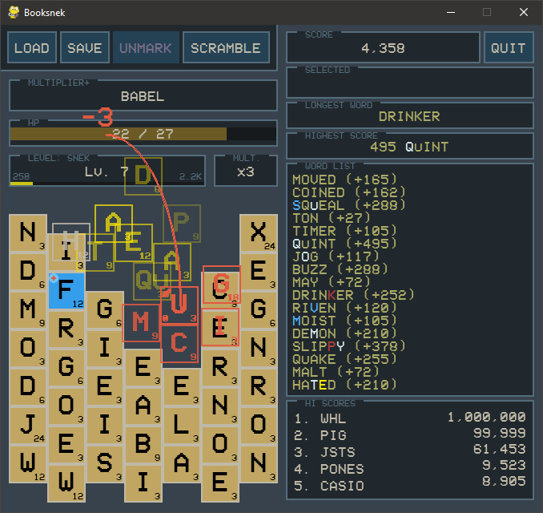

# Booksnek

🐍 **Booksnek** is an updated Pygame implementation of PopCap's classic Flash game Bookworm.

### Features
- Load & save gamestates
- `High score`, `longest word` and `best word` metrics
- Word history, including tile types used
- HP damage & heal mechanics replace the old "burn down the library" endgame
- "Explosive" area-effect tiles
- Quickly find tiles on the board by typing their letter
- Right click to mark tiles so you don't misplace them
- No more losing your power-up tiles on Scramble
- Word difficulty ranking system that prevents the game from choosing ridiculously rare bonus words like "PYX" and "QUIZZES"
- Letter distribution and value scales based on Scrabble
- Straightforward scoring system

### Requires
- Python 3.8.3
- Pygame 2.0.0.dev10
- Numpy 1.18.5

### TODO
- Add 'Gamestate saved' popup
- Add tutorial screenshots
- SFX (and menu to control)
- Music?

### Known bugs
- 'Invalid word' and 'Game over' popups' OK buttons are outside of windows
- Remove 'FER' from word list
- Add 'NAMER' to word list